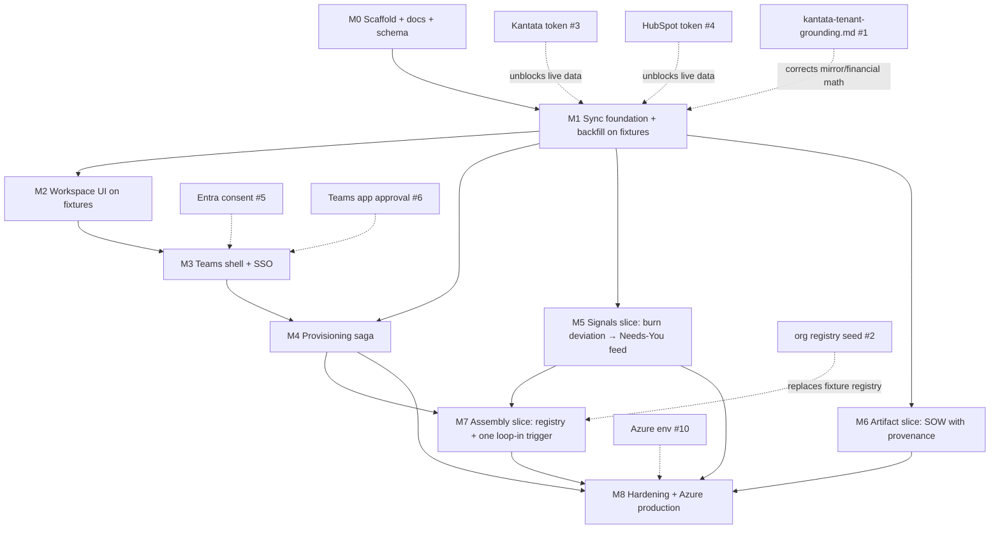

# Milestone Plan — AGP Project Command

Estimates assume one lead engineer (Claude-driven, human-approved) working continuously.
Foundation order (M0→M4) is fixed per SPEC.md; after that, thin vertical slices of
Layers 2–4 in demo-able increments. Estimates are calendar weeks including test/review
slack; external-approval wait time (BLOCKERS.md) is *not* included and overlaps by
starting requests at M0.

## Dependency graph

## Milestones

### M0 — Repo, docs, schema, sync core (this increment) — 1 week
SPEC.md, BLOCKERS.md, this plan, ADRs. pnpm monorepo (`apps/tab`, `apps/bot`,
`services/sync`, `services/signals`, `services/assembly`, `packages/shared`).
Supabase migrations for all schema groups (mirror, registry, workspace app,
intelligence, audit/queue). Sync foundation in code: `SourceAdapter` interface,
Kantata subscribed-events adapter + HubSpot polling adapter (fixture-backed),
durable dedup queue, poll→dirty-flag→hydrate pipeline, nightly reconcile,
rate-limited HTTP client, autonomy-tier gate. Tests: ingestion idempotency,
out-of-order/duplicate events, reconcile catches an injected gap, Tier A cannot
touch financial/client-facing paths. CI (typecheck/lint/test).

### M1 — Live sync + backfill — 2 weeks *(needs #3, #4 for live; fixtures otherwise)*
Real HTTP adapters against Kantata + HubSpot sandboxes, cursor persistence,
backfill jobs for full history (completed projects, closed deals, time entries,
engagements), nightly reconcile scheduled, correlation IDs + audit_log on every
external write. Conform mirror + financial fields to `kantata-tenant-grounding.md`
when it arrives (#1). Exit: mirror converges from a cold start; injected outage
recovered by reconcile with zero manual steps.

### M2 — Workspace UI on fixtures — 2 weeks
React tab app: project dashboard (status, timeline, budget vs. burn, projected
margin net of pass-through), resource planner (read first, then draft-allocation
write-back), engagement ROI card. Runs in plain browser with fixture data; Vercel
previews. Exit: AGP can click through a realistic project without any credentials.

### M3 — Teams shell — 1.5 weeks *(needs #5, #6)*
Agents Toolkit manifest, configurable tab + config page, Teams SSO with OBO
exchange + browser fallback, Entra↔Kantata identity mapping by email, theme
tokens, mobile rendering pass. Exit: tab opens in Teams with silent auth showing
synced data (SPEC Layer 1 acceptance).

### M4 — Deal-to-delivery provisioning — 2 weeks
Saga (`provisioning_jobs`): deal stage trigger → Kantata workspace (admin-editable
field mapping) → Teams channel (lazy retry, `filesFolder`, "preparing" state) →
pin tab → kickoff Adaptive Card → HubSpot backflow fields. Lost-deal archival.
Exit: test deal yields workspace + channel + tab + card in <5 min, idempotent
under duplicate triggers.

### M5 — Signals slice — 2 weeks
One signal end-to-end: budget-burn deviation vs. learned per-project baseline
(per commercial model), → `signals` → ranked Needs-You feed (personal tab +
morning card, max 5, one-tap actions) for the PM persona first. Dismissal
learning into `user_prefs_learned`. Autonomy-tier gate wired to real actions with
undo + audit. Then broaden signal types. Exit: SPEC Layer 2 acceptance on seeded
scenarios.

### M6 — Artifact slice — 2.5 weeks
pgvector corpus over backfilled history; SOW pipeline end-to-end: inputs →
retrieval of comparable won deals + actuals → draft with provenance chips →
approve → live scope baseline; scope-creep sentinel diffing actuals vs. baseline
→ Tier B change-order draft with dollar math. Exit: SPEC Layer 3 acceptance.

### M7 — Assembly slice — 2 weeks *(needs #2 for real org data)*
Registry ingest (seed json + admin UI), capability inference from Kantata
history, one playbook derived from completed projects, kickoff cast-plan card,
one loop-in trigger (capability keyword) with 60-second brief, decline→alternate
routing, utilization flagging. Exit: SPEC Layer 4 acceptance.

### M8 — Hardening + production — 2 weeks *(needs #10)*
Azure deploy pipeline, secrets in Key Vault, RLS review, load/rate-limit soak,
runbooks, metrics instrumentation (taps/user/week, signal-to-decision time, feed
act-rate, artifact edit distance, Kantata direct logins). Exit: production pilot
with the PM team.

**Total: ~15 engineering weeks** to a production pilot, demo-able from M2 onward.
Highest-risk external dependencies: Entra admin consent (#5) and Azure
environment (#10) — request at M0, not when needed.
